# Agent Engine

`Agent Engine` is a multi-role LLM CLI for code repositories. It runs a closed-loop workflow of analysis, judgment, preview, optimization, verification, and rollback/write-back.

It is a good fit for scenarios where you want to:
- let an LLM evaluate a project before deciding whether to change code
- preview modifications in an isolated workspace before confirming manually
- keep prompts, responses, command output, and traces in one audit trail

## Key Features

- Role separation: `executor`, `judge`, and `optimizer` can each be mapped to different models.
- Safe workspace: the project is copied into an isolated workspace by default, so the original tree is never edited directly.
- Manual confirmation: the workflow pauses for confirmation after the judgment stage before optimization begins.
- Scan mode: preview and rollback are checked first, then write-back is decided.
- Sensitive path protection: high-risk paths such as `.env`, secrets, and certificates are filtered by default.
- Auditable artifacts: prompts, responses, execution results, decision docs, and traces are retained.

## Architecture

```mermaid
flowchart TD
  U[User / Terminal] --> C[CLI]
  C --> G[Config Loader]
  C --> W[Workflow Runner]
  G --> P[Global + Project Config]

  W --> WS[Isolated Workspace]
  W --> EX[Executor LLM]
  W --> J[Judge LLM]
  W --> O[Optimizer LLM]
  W --> A[Artifact Store]

  EX -->|baseline command| R1[Execution Result]
  J -->|judgment + preview| D1[Judgment / Plan]
  O -->|edits| M1[Optimization Plan]

  W --> V[Verify Command / Scan]
  V --> RR[Final Decision]
  RR -->|accept| WB[Write back to original project]
  RR -->|reject| RB[Rollback from backup]
  W --> A
  WS --> A
```



## Workflow

1. Load global and project configuration.
2. Detect or select a profile.
3. Collect the optimization goal.
4. Run the baseline command in an isolated workspace.
5. Produce judgment and preview results.
6. Wait for user confirmation.
7. Generate an optimization plan and apply edits in the isolated workspace.
8. Run verification.
9. Produce the final decision, then write back or roll back.

## Install

```bash
go build ./cmd/agent-engine
```

## Quick Start

### 1. Initialize Configuration

```bash
./agent-engine init --root /path/to/project
```

During initialization, the following will be configured:
- LLM provider
- provider API endpoint
- executor / judge / optimizer model mapping
- API key storage method
- project profile

### 2. Run Optimization

```bash
./agent-engine run --root /path/to/project --goal "simplify code"
```

You can also provide a structured goal:

```bash
./agent-engine run \
  --root /path/to/project \
  --goal "simplify code" \
  --constraints "keep behavior" \
  --success "tests pass" \
  --risk "conservative" \
  --notes "focus on hot path"
```

### 3. Preview Mode

```bash
./agent-engine run --root /path/to/project --dry-run
```

### 4. Validate Configuration

```bash
./agent-engine validate --root /path/to/project
```

### 5. Inspect Configuration

```bash
./agent-engine config --root /path/to/project
```

## Configuration

### Global Configuration

The default location is determined by the system config directory. Common paths look like:

```text
~/Library/Application Support/agent-engine/config.json
```

or:

```text
~/.config/agent-engine/config.json
```

### Project Configuration

The project root will contain:

```text
.agent-engine.json
```

### Run Artifacts

By default, artifacts are written to:

```text
~/.local/state/agent-engine/runs/<run-id>
```

Each run stores:
- `goal.json`
- `plan.json`
- `judgment.json`
- `optimization.json`
- `decision.json`
- `trace.json`
- prompts and responses for each stage

## Default Profiles

If a project contains `go.mod`, the Go default profile is used automatically.

If a project contains `package.json`, the Node default profile is used automatically.

You can also specify a profile explicitly in the project configuration.

## Security Design

- Copy to an isolated workspace before any edits or verification.
- Back up related files automatically before changes are made.
- Roll back when the decision is to reject.
- Filter sensitive paths by default.
- API keys can be stored in `env` or `keychain`.

## Supported Providers

The current implementation uses the OpenAI-compatible API.

Any service that supports a chat/completions-style interface can be integrated.

## Directory Structure

```text
cmd/agent-engine     # CLI entrypoint
docs                 # User-facing docs and examples
internal/cli         # command parsing and interaction
internal/config      # config loading, saving, and wizard
internal/model       # data models
internal/provider    # LLM provider
internal/project     # profile, workspace, and file sync
internal/secret      # env / keychain secret storage
internal/workflow    # core optimization workflow
```

## More Docs

- [License](LICENSE)
- [Changelog](CHANGELOG.md)
- [Profile Examples](docs/profile-examples.md)

## License

This project is released under the MIT License. See [LICENSE](LICENSE).
