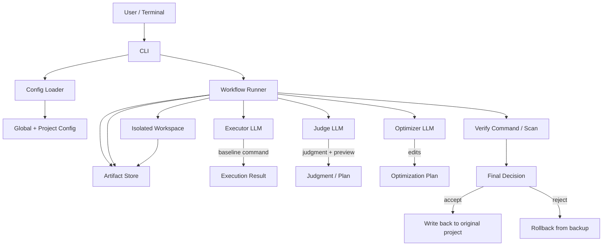

# Agent Engine

`Agent Engine` is a multi-role LLM CLI for code repositories. It turns an ad hoc coding request into a safe, repeatable workflow: analyze, judge, preview, optimize, verify, and either write back or roll back.

> Designed for teams that want AI-assisted code changes without giving up control, traceability, or rollback safety.

## What It Gives You

- Clear role separation: `executor`, `judge`, and `optimizer` can each map to a different model.
- Safer execution: changes happen in an isolated workspace, not the original tree.
- Human approval gate: the workflow pauses after judgment and before optimization.
- Scan mode support: preview first, then decide whether to write back.
- Sensitive path filtering: high-risk files such as `.env`, secrets, and certificates are excluded by default.
- Full audit trail: prompts, responses, command output, decisions, and traces are preserved.

## Architecture



## How It Works

1. Load global and project configuration.
2. Detect or select a profile for the target repo.
3. Collect the optimization goal and constraints.
4. Copy the project into an isolated workspace.
5. Run the baseline command and capture results.
6. Produce judgment and preview artifacts.
7. Wait for user confirmation.
8. Generate and apply the optimization plan.
9. Run verification, then write back or roll back.

## Install

```bash
go build ./cmd/agent-engine
```

## Quick Start

### 1. Initialize a Project

```bash
./agent-engine init --root /path/to/project
```

During initialization, the following will be configured:
- LLM provider selection
- provider API endpoint
- executor / judge / optimizer model selection from a curated menu
- API key storage method
- project profile

### 2. Run an Optimization

```bash
./agent-engine run --root /path/to/project --goal "simplify code"
```

You can also provide a structured goal:

```bash
./agent-engine run \
  --root /path/to/project \
  --goal "simplify code" \
  --constraints "keep behavior" \
  --success "tests pass" \
  --risk "conservative" \
  --notes "focus on hot path"
```

### 3. Preview Only

```bash
./agent-engine run --root /path/to/project --dry-run
```

### 4. Validate Configuration

```bash
./agent-engine validate --root /path/to/project
```

### 5. Inspect Configuration

```bash
./agent-engine config --root /path/to/project
```

## Configuration

### Global Configuration

The default location is determined by the system config directory. Common paths are:

```text
~/Library/Application Support/agent-engine/config.json
```

or:

```text
~/.config/agent-engine/config.json
```

### Project Configuration

The project root contains:

```text
.agent-engine.json
```

### Run Artifacts

By default, run artifacts are written to:

```text
~/.local/state/agent-engine/runs/<run-id>
```

Each run stores:
- `goal.json`
- `plan.json`
- `judgment.json`
- `optimization.json`
- `decision.json`
- `trace.json`
- prompts and responses for each stage

## Default Profiles

| Project marker | Default profile |
| --- | --- |
| `go.mod` | Go |
| `package.json` | Node |

You can also set a profile explicitly in the project configuration.

## Security Design

- Copy to an isolated workspace before edits or verification.
- Back up related files automatically before changes are made.
- Roll back when the decision is to reject.
- Filter sensitive paths by default.
- Store API keys in `env` or `keychain`.

## Supported Providers

The current implementation supports OpenAI-compatible, Anthropic Claude, and Google Gemini providers.

The first-run wizard offers a curated set of common model choices for each provider plus a custom option.

## Directory Structure

```text
cmd/agent-engine     # CLI entrypoint
docs                 # User-facing docs and examples
internal/cli         # command parsing and interaction
internal/config      # config loading, saving, and wizard
internal/model       # data models
internal/provider    # LLM provider
internal/project     # profile, workspace, and file sync
internal/secret      # env / keychain secret storage
internal/workflow    # core optimization workflow
```

## More Docs

- [License](LICENSE)
- [Changelog](CHANGELOG.md)
- [Profile Examples](docs/profile-examples.md)

## License

This project is released under the MIT License. See [LICENSE](LICENSE).
